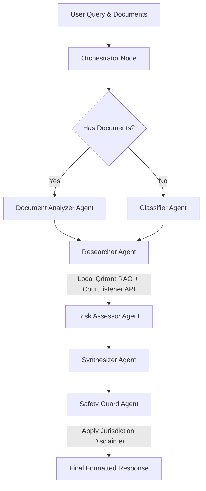

# Lex AI — Multi-Agent Legal Aid System

Lex AI is a premium, open-source multi-agent legal assistance application. It is designed to help self-representing individuals, low-income tenants, and contract reviewers navigate legal situations, identify exposure, search case law, and analyze lease covenants or agreements using AI.

The system is powered by a **FastAPI backend**, a **Vanilla HTML/CSS/JS SPA frontend**, **LangGraph multi-agent workflows**, and a hybrid retrieval-augmented generation (RAG) system utilizing **Qdrant local serverless database** and the **CourtListener Open Opinions API**.

---

## 🏗️ Multi-Agent Architecture

Lex AI orchestrates specialized AI agents in a structured, state-based graph using **LangGraph**. The workflow dynamically adapts depending on whether you upload a lease or a legal document.

### Agent Workflow Diagram



### Agents Breakdown
1. **Orchestrator:** Initializes the graph state, logs decisions, and decides execution routing.
2. **Classifier:** Categorizes inquiries (e.g., `tenant_rights`, `employment`, `contract`), extracts legal concepts, and flags jurisdiction dependencies.
3. **Document Analyzer:** Processes uploaded contracts/leases page-by-page. Identifies red flags (with severity ratings), missing tenant protections, unusual clauses, financial liabilities, and critical deadlines.
4. **Researcher:** Conducts hybrid search. Queries local document vectors inside the Qdrant DB and retrieves related federal and state court opinions using the external CourtListener Search API.
5. **Risk Assessor:** Conducts a multi-dimensional risk assessment scoring legal risk, financial risk, time-sensitivity, and complexity (1-10) and recommends immediate actions or attorney consulting.
6. **Synthesizer:** Incorporates retrieved case law and local documents to structure a response using Nvidia's Llama 3.3.
7. **Safety Guard:** Ensures compliance by checking for legal advice assertions, adding local hotlines/resources (EEOC, Tenant Unions, etc.), and appending mandatory legal disclaimers.

---

## ✨ Features

- ⚡ **Interactive SPA Interface:** Built with clean Vanilla JS, Outfit & Inter typography, glassmorphism, responsive sidebar widgets, and animated agent pipeline progression.
- 📂 **Local Document Ingestion:** Custom PDF text extraction, chunking, and vector upload using local HuggingFace embeddings (`all-MiniLM-L6-v2`) — **no external API keys required for vectors**.
- ⚖️ **Real-world Case citations:** Automatically resolves queries with actual U.S. court opinions (case names, court jurisdictions, and citations) via CourtListener API.
- 🛡️ **Built-in Safety Checks:** Programmatic disclaimers, domain-specific emergency resources, and attorney referral recommendations.
- 🧠 **Offline Vector Store:** Automatically runs serverless local storage (`./qdrant_data`), removing the need to manage a separate running database engine for local workloads.
- 🐳 **Dockerized Service Setup:** Pre-configured Docker Compose file to spin up both the FastAPI application and a Qdrant cluster container instantly.

---

## 🚀 Setup & Installation

### Prerequisites
- Python 3.11+
- Virtual Environment tool (`venv`)
- *Optional:* Docker & Docker Compose (if containerized run is desired)

### Local Development Setup

1. **Clone the Repository:**
   ```bash
   git clone <your-repository-url>
   cd legal-aid-system
   ```

2. **Configure Environment Variables:**
   Copy the example environment file and configure your API credentials.
   ```bash
   copy .env.example .env
   ```
   *Note:* Get your Nvidia API key from [Nvidia Build](https://build.nvidia.com/) (free tier available) and an optional CourtListener API token from [CourtListener](https://www.courtlistener.com/).

3. **Create and Activate Virtual Environment:**
   ```bash
   python -m venv venv
   # On Windows (PowerShell):
   .\venv\Scripts\Activate.ps1
   # On macOS/Linux:
   source venv/bin/activate
   ```

4. **Install Dependencies:**
   ```bash
   # Exclude pywin32 to support cross-compatible Docker builds
   pip install -r requirements.txt
   ```

5. **Ingest Legal Reference Documents:**
   Place PDF files (e.g., California Tenant's Rights Handbook) in the `documents/` folder, then run the ingestion script to vectorize and store them in the local Qdrant database:
   ```bash
   python ingest.py
   ```

6. **Run the FastAPI Server:**
   ```bash
   python main.py
   ```

7. **Access the App:**
   Open [http://localhost:8000](http://localhost:8000) in your web browser.

---

## 🐳 Docker Deployment

To spin up the system (FastAPI backend and a dedicated Qdrant database container) in Docker:

1. Build and start containers:
   ```bash
   docker compose up --build
   ```
2. The FastAPI application will compile and host the dashboard on [http://localhost:8000](http://localhost:8000). Qdrant console will be accessible on [http://localhost:6333/dashboard](http://localhost:6333/dashboard).

---

## 🧪 Testing & Evaluation

Lex AI comes equipped with built-in test suites to verify index building, database connection dimensions, and overall agent scoring:

- **Check Qdrant Serverless:** Tests creation and querying of collections.
  ```bash
  python test_query_points.py
  ```
- **LlamaIndex Pipeline Check:** Tests vector indexing.
  ```bash
  python test_pipeline.py
  ```
- **RAG Ingestion Evaluation:** Evaluates pipeline answering accuracy and context alignment with a fallback semantic scorecard.
  ```bash
  python eval.py
  ```
- **LangGraph Multi-Agent Verification:** Automatically tests agent routing, classification domain accuracy, risk score tolerances, and citation formats.
  ```bash
  python eval/legal_eval.py
  ```

---

## 📄 License & Disclaimer

This project is licensed under the MIT License.

*Disclaimer: Lex AI is an educational tool designed to help self-representing individuals navigate public legal resources and documents. It does not constitute formal legal advice, representation, or counsel. Users should always consult a licensed attorney for specific legal issues.*
